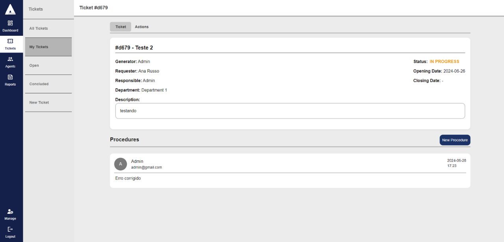

# Ticketing System (Help Desk)  

This project involves a Help Desk System that is intuitive, efficient, and accessible to both users and administrators. The requirements include a login service, user management (client and administrator), a service to handle tickets and workflows, and an email service to notify clients about each update. I chose to use a microservices architecture and multiple databases, making this project an ideal challenge to apply my personal studies.  

### Objective  

Develop a simple ticketing system with login functionality, client and administrator roles, ticket creation, ticket history, and email notifications.  

### **Basic requirements**  

- Login Service  
- User Service  
- Admin Service  
- Ticket Service  
- Email Service  

### **Functional Requirements**  

1. **Authentication:**  
    - User registration service (client and administrator).  
    - Login service.  

2. **User Management:**  
    - Service for client functionalities.  
    - Service for administrator functionalities.  

3. **Tickets:**  
    - Service to create a new ticket.  
    - Service to list all tickets.  
    - Service to list specific tickets for a client.  
    - Service to assign a ticket to an administrator.  
    - Service to respond to a ticket (message).  

4. **Message History:**  
    - Service to add messages to a ticket’s history.  
    - Service to retrieve the message history of a ticket.  

5. **Email Notifications:**  
    - Service to send email notifications to clients for each ticket update.  

6. **Administration:**  
    - Administrative interface to view and manage all tickets.  
    - Tool to assign tickets to administrators.  

### Architecture and Technologies  

  

### Screens

  

  

  

  

